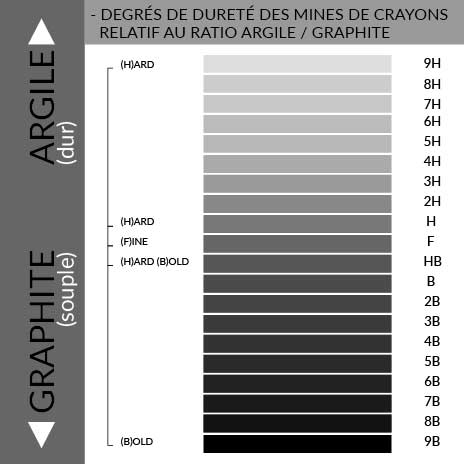
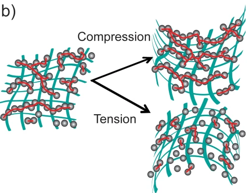
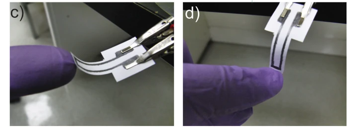
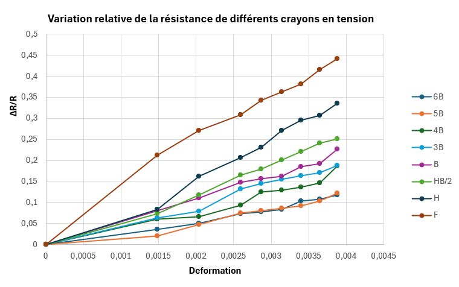
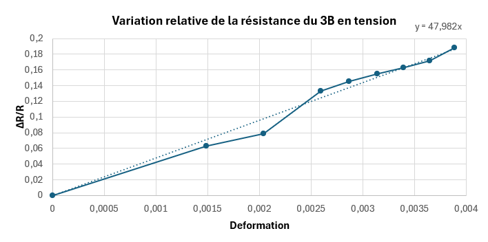
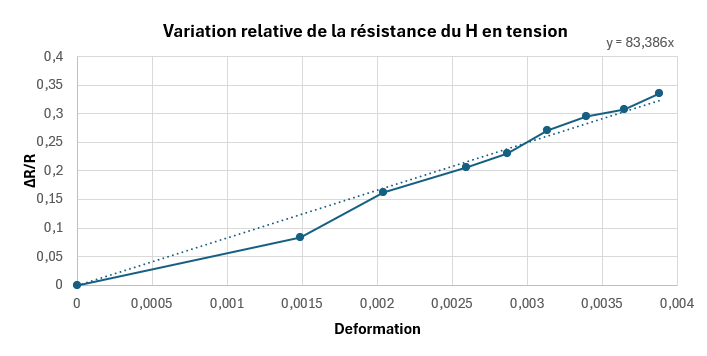
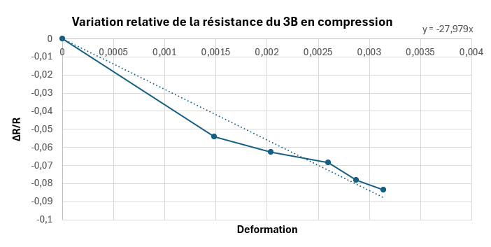
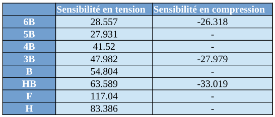

# 2024-2025-4GP-Estelle AUBRY-Lucas BOURDARIE
Projet capteur 2024 - 2025 | Estelle AUBRY et Lucas BOURDARIE | 4ème année, 59ème promotion

# Table des matières

[Présentation du projet](https://github.com/MOSH-Insa-Toulouse/2024-2025-4GP-Haistelle-Lucbourd?tab=readme-ov-file#pr%C3%A9sentation-du-projet)

[I - Un capteur à base de graphite, c'est possible ?](https://github.com/MOSH-Insa-Toulouse/2024-2025-4GP-Haistelle-Lucbourd?tab=readme-ov-file#i---un-capteur-%C3%A0-base-de-graphite-cest-possible-)

[II - Simulation sous LTSpice](https://github.com/MOSH-Insa-Toulouse/2024-2025-4GP-Haistelle-Lucbourd?tab=readme-ov-file#ii---simulation-sous-ltspice)

[III - Réalisation du PCB avec KiCAD](https://github.com/MOSH-Insa-Toulouse/2024-2025-4GP-Haistelle-Lucbourd?tab=readme-ov-file#iii---r%C3%A9alisation-du-pcb-avec-kicad)

[IV - Le banc de test automatisé](https://github.com/MOSH-Insa-Toulouse/2024-2025-4GP-Haistelle-Lucbourd?tab=readme-ov-file#iv---le-banc-de-test-automatis%C3%A9)

[V - Le code Arduino pour piloter le projet](https://github.com/MOSH-Insa-Toulouse/2024-2025-4GP-Haistelle-Lucbourd/tree/main?tab=readme-ov-file#v---le-code-arduino-pour-piloter-le-projet)

[VI - L'application Android avec Mit App Inventor](https://github.com/MOSH-Insa-Toulouse/2024-2025-4GP-Haistelle-Lucbourd/tree/main?tab=readme-ov-file#vi---lapplication-android-avec-mit-app-inventor)

[Résultats](https://github.com/MOSH-Insa-Toulouse/2024-2025-4GP-Haistelle-Lucbourd/tree/main?tab=readme-ov-file#résultats)

# Présentation du projet 
 

 Ce projet a été mené dans le cadre de l'UF  "Du capteur au banc de test" . L'objectif est de réaliser un capteur de déformation à base de graphite. Pour ce faire, il suffit simplement de déposer du crayon à papier sur un bout de feuille. La tension ou la compression du papier engendre une variation de résistance qui est proportionnelle à la déformation appliquée. Les principes physiques qui se cachent derrière ce phénomène sont expliqués <a href="https://github.com/MOSH-Insa-Toulouse/2024-2025-4GP-Haistelle-Lucbourd/blob/main/README.md#i---un-capteur-%C3%A0-base-de-graphite-cest-possible-">ici</a>. Le projet s'inscrit donc dans une démarche low-tech car le capteur nécessite peu de ressources et sa réalisation est accessible à tous !

 De plus, le capteur graphite réalisé sera testé de manière à comparer ses performances avec un capteur de déformation commercial. Nous souhaitons dégager les forces et les limites du capteur graphite par rapport à un capteur commercial. Finalement, nous établirons une conclusion quant à la possible industrialisation de ce type de capteur.

[INSÉRER IMAGE PROJET FINI]

 

 ## Livrables
À la fin de ce projet, plusieurs livrables sont attendus:
- Un **PCB** sur lequel seront connectés tous les éléments cités dans la partie [Matériel utilisé](https://github.com/MOSH-Insa-Toulouse/2024-2025-4GP-Haistelle-Lucbourd/blob/main/README.md#mat%C3%A9riel-utilis%C3%A9)
- Un **banc de test** pour étudier la déformation du capteur graphite et du capteur commercial
- Un **code Arduino** qui permette de contrôler le banc de test et d'afficher les mesures de résistances
- Une **datasheet** qui énonce toutes les caractéristiques du capteur graphite
- Une **application Android** (.apk) pour visualiser les relevés de mesures en direct

## Matériel utilisé 
Pour le **montage**, voici tout le matériel requis:
- Une carte Arduino UNO
- Un écran OLED (I2C) 
- Un module Bluetooth HC-05
- Un potentiomètre numérique MCP41050
- Un encoder rotatif
- Un capteur de déformation commercial (FlexSensor) pour effectuer une comparaison
- Des crayons à papiers différents pour les tests
- Un servo moteur
- Des header de différentes tailles pour fixer les composants sur le PCB
- Une résistance de 33k

Pour réaliser **l'amplificateur transimpédance**, la liste de matériel est la suivante:
- Un amplificateur opérationnel LTC1050
- Deux condensateurs de 100nF
- Un condensateur de 1uF
- Deux résistances de 100k
- Deux résistances de 1k
- Une résistance de 10k

# I - Un capteur à base de graphite, c'est possible ?

Oui et c'est ce qu'a montré l'équipe de chercheurs Lin, CW., Zhao, Z., Kim, J. et al. dans l'article <em>Pencil Drawn Strain Gauges and Chemiresistors on Paper</em> paru en 2014. En effet, les crayons à papier sont composés de graphite et d'argile dans des proportions différentes. Par exemple, le crayon HB est constitué à 50% de graphite et à 50% d'argile. Ces différences de compositions entraînent des propriétés de conduction qui diffèrent selon le type de crayon utilisé. Lorsque l'on dépose du crayon à papier sur une feuille, les nanoparticules de graphite déposées constituent un système dit <strong>granulaire</strong>. Il s'agit d'un système dont les grains forment un réseau très désordonné au sein duquel les électrons se déplacent d'un grain à un autre par <strong>effet tunnel</strong>. L'équipe de chercheurs a donc démontré que les crayons <strong>durs</strong> comme l'HB possédaient une résistance plus importante que les crayons <strong>légers</strong> comme le 9B. Ceci s'explique par le fait que les crayons durs comme l'HB contiennent plus d'argile qu'un crayon léger qui contient plus de graphite. L'argile joue le rôle d'un isolant, plus il y en a, plus la conduction des électrons au sein du matériau est difficile. À l'inverse, les nanoparticules de graphite permettent la conduction des électrons, c'est pour cela que le crayon 9B est moins résistif que le crayon HB. 

  
  
<em>Figure : Les différents types de crayons: du 9B au 9H</em>

 
<em>d'après le site Passage Clouté à l'adresse<a href="https://passagecloute.com/blog/post/8_comment-choisir-le-bon-crayon-graphite-du-9h-au-9b.html?page_type=post"> suivante</a> </em>

De plus, les chercheurs ont aussi prouvé que les crayons pouvaient se comporter comme des <strong>jauges de contraintes</strong>. En dessinant au crayon une forme de U avec deux rectangles au bout pour les électrodes de contact, les chercheurs ont remarqué qu'une déformation en compression et en tension avaient des effets différents sur la <strong>résistance</strong> du capteur. La compression du capteur compresse les particules de graphite et induit une diminution de la résistance. Au contraire, la tension du capteur éloigne les particules de graphite ce qui augmente résistance. 

  
  
<em>Figure : Structure granulaire en compression et en tension</em>

  
  
<em>Figure : c) Capteur graphite en compression d) Capteur graphite en tension </em>

 
<em>d'après Lin, CW., Zhao, Z., Kim, J. et al., 2014 </em>

Cependant, l'équipe conclut que l'observation de ces phénomènes n'est pas possible pour des crayons composés de plus d'argile que le crayon HB. Selon eux, le réseau de nanoparticules du crayon HB se situe juste au dessus du <strong>seuil de percolation</strong>. Le seuil de percolation c'est le seuil à partir duquel le matériau devient conducteur car les électrons peuvent traverser. Néanmoins, nous allons montrer que, grâce à l'utilisation d'un <strong>amplificateur transimpédance</strong>, il est possible de mesurer des résistances pour des crayons plus légers que le HB. Par conséquent, la structure de ces crayons permet de passage des électrons et ne se situe pas en dessous du seuil de percolation.   

# II - Simulation sous LTSpice et formules utiles

 D'après l'étude menée par les chercheurs, le capteur graphite a une résistance qui peut varier d'une centaine de kohms à des Mohms. Les résistances très élevées sont délicates à mesurer. En effet, une méthode classique consiste à utiliser un ohmmètre mais pour mesurer des résistances de cet ordre de grandeur les options sont chères. De plus, nous utilisons une carte Arduino dont l'impédance maximale de la source ne peut pas dépasser 10 kohms. Il n'est donc pas possible de brancher directement notre capteur graphite sur la carte. De ce fait, nous allons amplifier le signal et diminuer son impédance à l'aide d'un amplificateur transimpédance. Nous utilisons pour cela un amplificateur opérationnel LTC1050 car il est suffisamment sensible pour amplifier correctement le signal. Il s'agit également d'un amplificateur très précis qui possède un offset voltage de 5 uV, négligeable par rapport à la tension mesurée sur l'entrée non-inverseuse. Si l'on considère que le courant délivré par le capteur graphite est de 100 nA et que la résistance de R1 vaut 100komhs, alors la tension Vep = I x R1 = 10 mV >> 5 uV.

## A) Montage avec l'amplificateur transimpédance

  
  
<em>Figure : Schéma de l'amplificateur transimpédance dans LTSpice </em>

De plus, il va falloir filtrer le bruit. Pour ce faire, nous mettons en place 3 filtres passe-bas:
 <ul>
  <li>un pour filtrer le bruit du capteur en jaune.</li>
  <li>un pour filtrer le 50Hz en vert.</li>
  <li>un pour filtrer les variations plus rapides que 7kHz en rouge. D'après le critère de Shannon, fech > 2*fsignal. Or, pour une carte Arduino, la fréquence d'échantillonage vaut 15 kHz donc fsignal < 7kHz.  </li>
</ul>

## B) Formules
À partir de ce montage, nous pouvons établir la formule nécessaire pour relier la tension en sortie de l'amplificateur transimpédance à la résistance du capteur graphite.

  
  
<em>Figure : Formule qui lie la résistance du capteur graphite à la tension Vadc mesurée en sortie </em>

De la même manière, pour le capteur commercial, nous faisons un pont diviseur de tension avec une résistance de 33k. La formule qui relie la tension de sortie à la résistance du capteur commercial est la suivante: 

  
  
<em>Figure : Formule qui lie la résistance du capteur commercial à la tension V_flex mesurée en sortie </em>

# III - Réalisation du PCB avec KiCAD

 Ensuite, nous avons designé un PCB simple face à l'aide du logiciel KiCAD. Il est à noter que l'entrée du capteur graphite est reliée à l'amplificateur transimpédance. Afin de permettre un meilleur contrôle de l'amplification du signal, la résistance R2 de la figure ... a été remplacée par un potentiomètre numérique. Le conditionneur utilisé pour le capteur commercial est un pont diviseur de tension avec une résistance de 33k. De plus, nous avons ajouté un condensateur pour faire du débouncing sur l'encoder rotatif. Nous avons suivi ces étapes:

**1)** **Dessiner** les composants tels que l'OLED, l'encoder rotatif, le module Bluetooth, le capteur commercial et le capteur graphite

**2)** Réaliser les **empreintes** de ces composants

**3)** Sélectionner les résistances, les condensateurs et l'AOP pour **réaliser l'amplificateur transimpédance** dans l'éditeur de Schématique

**4)** Établir les **points de connexion** entre la carte Arduino et tous les composants

**5)** **Positioner** les composants sur la PCB

**6)** Importer les **modèles 3D** pour les composants non-présents par défaut dans les librairies (OLED, encoder rotatif, module Bluetooth, capteur commercial)

**7)** Faire **le routage** dans l'éditeur de PCB en évitant au maximum les masses flottantes et les vias

**N.B**: Le servo moteur n'apparaît pas ici car il sera relié à la carte Arduino par le biais d'un header.

  
  
<em>Figure : Vue depuis l'éditeur de Schématique </em>

  
  
<em>Figure : Vue depuis l'éditeur de PCB </em>

  
  
<em>Figure : Vue 3D </em>

# IV - Le banc de test automatisé

  
  
<em>Figure : Rendu du banc de test final</em>

 Afin d'optimiser notre relevé de mesures, nous avons mis au point un banc de test qui courbe automatiquement le capteur de déformation. De cette manière, nous minimisons les risques de dégradation du capteur graphite lors des relevés de mesure car nous ne touchons pas le capteur dès lors qu'il est positionné sur le banc de test. Le banc de test a été réalisé sous Fusions360 puis imprimé en 3D. Ce dernier permet des relevés entièrement personnalisables par l'utilisateur grâce au code Arduino développé. Avec ce banc de test, il est possible de réaliser des mesures sur le capteur graphite et le capteur commercial. Les mesures en tension se sont révélées être les plus faciles à mettre en place que les mesures en compression qui sont plus délicates.

## A) La glissière pilotée par le servo moteur

  
  
<em>Figure : Rendu de la glissière écrantée avec encoche fendue ainsi que de l'engrenage fixé au servo</em>

  Pour courber le capteur de déformation, nous avons utilisé un système de glissière qui se déplace sous l'action du servo moteur. En effet, nous avons conçu un engrenage qui se fixe sur le servo moteur et dont la rotation entraîne une glissière écrantée. Le bout de cette glissière est fait en forme d'encoche pour maintenir le capteur. Pour éviter que le capteur ne sorte de l'encoche au cours des mesures, nous avons également imprimé des petites cales qui assurent que le capteur reste bien  positionné. Enfin, nous avons imprimé deux glissières différentes, une pour le capteur commercial et une pour le capteur graphite car le capteur commercial était beaucoup plus long que le capteur graphite. La glissière du capteur commercial possède une petite fente en bas de l'encoche (voir figure ...) pour le maintenir correctement et permettre une déformation qui épouse mieux les rayons de courbure.

## B) Les rayons de courbure interchangeables

  
  
<em>Figure : Gamme de rayons de courbure imprimés</em>

 Pour tester les capteurs, nous avons imprimé huit supports en 3D avec différents rayons de courbure. Ces supports s'imbriquent sur le banc de test comme nous pouvons le voir sur la photo [INSÉRER n°figure]. Les numéros qui figurent sur les supports correspondent à l'angle entre le bord jaune et le bord rouge. 

# V - Le code Arduino pour piloter le projet

## A) Description générale 

 Le code développé permet à l'utilisateur de gérer facilement et intuitivement le banc de test pour effectuer les mesures. L'affichage se fait sur l'écran OLED sur lequel apparaissent <a href="https://github.com/MOSH-Insa-Toulouse/2024-2025-4GP-Haistelle-Lucbourd/tree/main?tab=readme-ov-file#b-les-diff%C3%A9rentes-fonctionalit%C3%A9s">les différentes fonctionnalités</a>. L'utilisateur peut parcourir les différents menus en tournant l'encoder rotatif dans le sens horaire ou anti-horaire. Pour "rentrer" dans un menu, il suffit d'appuyer sur l'encoder et l'interface se met à jour. Chaque menu possède sa propre fonctionalité que l'utilisateur peut librement régler. En principe, l'ordre des menus correspond à l'ordre dans lequel l'utilisateur doit effectuer les réglages avant de lancer la mesure via le menu "Démarrage" à la fin. Il est préférable de ne pas placer le capteur sur le banc de test avant le menu "Borne" pour ne pas l'abîmer lors des précédents réglages.

## B) Les différentes fonctionalités
### 1 - Le menu "BIENVENUE"

   
 
<em>Figure : menu de bienvenue </em>

Ce menu souhaite la bienvenue à l'utilisateur. Il ne possède pas le fonctionalité particulière.

### 2 - Le menu "CONFIGURATION"

   
   
 
<em>Figure : menu de configuration </em>

 Ce menu permet à l'utilisateur de définir quel type de capteur il utilise entre le capteur graphite et le capteur commercial. Une fois le type de capteur sélectionné (fond bleu et écriture noire), il suffit d'appuyer sur l'encoder rotatif pour enregistrer le choix. 

### 3 - Le menu "CALIBRATION"
 

   
   
 
<em>Figure : menu de calibration </em>

 Dans ce menu, l'utilisateur peut régler la valeur prise par le potentiomètre numérique de manière à ne pas saturer l'amplificateur opérationnel. Attention, ce menu n'est utile que lorsque le type de capteur choisi est le graphite car le potentiomètre numérique est utilisé dans l'amplificateur transimpédance. L'interface affiche à la fois la valeur de résistance prise par le potentiomètre numérique et le signal lu par l'entrée analogique du capteur graphite. Il s'agit donc d'une valeur comprise entre 0 et 1023. Lors des mesures, il faut également anticiper la variation de résistance engendrée par la déformation du capteur graphite. En effet, en compression, la résistance lue diminue donc le signal augmente et peut, si le potentiomètre n'est pas correctement réglé, saturer l'AOP. 

### 4 - Le menu "VITESSE"

   
   
 
<em>Figure : menu de réglage de la vitesse </em>

 Dans le menu "Vitesse", l'utilisateur peut régler la vitesse à laquelle il souhaite effectuer les mesures, c'est-à-dire, la vitesse à laquelle la glissère reliée au servo moteur va se déplacer. L'écran affiche un pourcentage qui correspond à la vitesse du servo moteur. 0% correspond à la <strong>vitesse minimale</strong> et 100% la <strong>vitesse maximale</strong>. Pour augmenter la vitesse, il est nécessaire de tourner l'encodeur rotatif dans le sens <strong>anti-horaire</strong> car il s'agit en réalité de <strong>diminuer</strong> le délai entre chaque incrément du servo moteur. La vitesse maximale correspond à un délai de <strong>5ms</strong> tandis que la vitesse minimale correspond à un délai de <strong>40ms</strong>. De plus, lorsque la vitesse change (= l'encoder change de position), le servo moteur effectue un aller-retour au cours duquel il est possible faire varier la vitesse du servo à l'aide de l'encoder jusqu'à obtenir la vitesse désirée. L'affichage en % de la vitesse s'effectue <strong> à la fin </strong>  de l'aller-retour. Il n'y a donc pas d'affichage en direct de la vitesse mais seulement après que le servo moteur ait fait un aller-retour. D'après la figure ci-dessous, comme l'encoder est utilisé pour faire varier le délai, la variable encoder_pos peut prendre des valeurs comprises entre 5 et 40 uniquement. 

  
  
<em>Figure : Algorigramme qui présente le déroulé de la fonction "Vitesse"</em>

### 5 - Le menu "BORNE"

   
   
 
<em>Figure : menu de réglage de la borne </em>

 À partir de cette étape, il faut placer le capteur sur le banc de test. Le menu "Borne" permet à l'utilisateur de régler la position maximale du servo moteur et par conséquent, celle de l'encoche qui maintient le capteur contre le support. De cette manière, l'utilisateur peut s'assurer que le capteur épouse correctement la forme du rayon de courbure. Pour augmenter ou diminuer la position maximale, il faut tourner l'encoder rotatif dans le sens hoaire ou anti-horaire. 

 
### 6 - Le menu "MODE de MESURE"

   
   
 
<em>Figure : menu de sélection du mode de mesure </em>

 À l'intérieur de ce menu, l'utilisateur définit le nombre de mesures qu'il souhaite faire. En effet, nous avons pensé que comme les valeurs de résistances lues en direct peuvent parfois varier beaucoup, il pourrait être intéressant de permettre à l'utilisateur de faire une moyenne sur un nombre de mesures qu'il définit lui-même. De ce fait, lorsque la valeur choisie est "5" par exemple, le code effectuera 5 relevés de résistances pour un même rayon de courbure. Le servo fera donc un aller, une mesure puis un retour, le tout 5 fois. La valeur finale affichée correspondra à une moyenne de la résistance sur les 5 mesures. Le nombre de mesure réalisable est compris entre 1 et 20. 

### 7 - Le menu "DÉMARRAGE"

   
   
   
 
<em>Figure : menu de démarrage de la mesure </em>

Le menu démarrage permet de lancer l'acquisition de mesure. Il prend en compte tous les paramètres précedemment définis par l'utilisateur. Par exemple pour des paramètres tels que:
- **Vitesse**: 52%
- **Borne**: 150
- **Mode de mesure**: 5
Le servo moteur effectuera 5 aller-retours jusqu'à la position 150 du servo à une vitesse de 52% de la vitessse maximale.

  
  
<em>Figure : Algorigramme qui présente le déroulé de la fonction "Démarrage"</em>

### 8 - Le menu "LiveVIEW"

   
   
 
<em>Figure : menu de mesure en direct </em>

 Ce menu permet un affichage en direct de la valeur de résistance lue par l'entrée analogique. Il faut se placer à l'intérieur de ce menu pour utiliser l'application Android car les données sont envoyées au téléphone via le module Bluetooth HC-05. 

# VI - L'application Android avec Mit App Inventor

 Cette application permet de recevoir les donnnées envoyées par le module Bluetooth du PCB et de les afficher sous forme de graphique. Pour ce faire, les données lues par l'entrée analogique du capteur suivent le processus suivant:

[insérer image explicative]

## A) L'écran de démarrage

 L'écran de démarrage comporte un seul bouton "Démarrer" sur lequel il suffit de cliquer pour lancer l'application.

  
  
<em>Figure : Écran de démarrage de l'application </em>

## B) L'interface principale et ses fonctionalités

 Sur le deuxième écran, l'utilisateur doit tout d'abord connecter son téléphone au module Bluetooth pour recevoir les données. Lorsque la connexion est établie, le bouton "Bluetooth connexion" s'affiche en vert. Ensuite, un switch permet de définir quel capteur est utilisé. Si l'on utilise le capteur graphite, il faut renseigner la valeur du potentiomètre numérique dans la case rose pour afficher la bonne valeur de résistance dans la case bleue claire. Par défaut, la valeur de R2 vaut 875 ohms. Un graphique en dessous permet d'afficher en direct les bytes reçus par le module Bluetooth. Les bytes reçus sont également affichés dans la case jaune en dessous du graphique. 

  
  
<em>Figure : Écran de démarrage de l'application </em>

# Résultats

 
Pour réaliser nos mesures, nous avons tracé l'évolution de la variation relative de résistance en fonction de la déformation. Pour la variation relative de résistance, nous appliquons la formule ci-dessous. Rplat correspond à la résistance du capteur graphite sans déformation appliquée et Rcourbé à la résistance mesurée quand le capteur est déformé.

  
  
<em>Figure : Formule de la variation relative de résistance</em>

Pour calculer la déformation, nous effectuons le calcul ci-dessous pour tous nos rayons de courbures afin de trouver la déformation correspondante. e correspond à l'épaisseur de la feuille de papier utilisée.
 

  
  
<em>Figure : Formule pour calculer la déformation</em>

Le coefficient de proportionalité qui lie la variation relative de résistance et la déformation correspond à la <strong>sensibilité</strong> du capteur. 

  Pour réaliser tous nos tests nous avons choisi une vitesse de 52% pour le servo moteur. Les crayons testés sont le 6B, 5B, 4B, 3B, B, HB, F et H pour des mesures en tension. Les tests ont été effectués sur chaque rayon de courbure disponible. Pour les mesures en compression, les tests ont été réalisés sur les crayons 6B, 3B et HB pour des rayons de courbure allant jusqu'à [...]. Pour <strong> chaque point </strong>, nous avons réalisé 5 mesures de résistance pour un type de crayon et un rayon de courbure donné et pris la moyenne de ces 5 mesures comme résultat final. Au total, pour les mesures en tension cela nous fait 8 (crayons) x 8 (supports) x 5 (mesures pour 1 type de crayon et un rayon de courbure donné) = <strong>320 mesures</strong>. Pour les mesures en compression, nous avons 3 (crayons) x 6 (supports) x 5 (mesures) = <strong>90 mesures</strong>. Nous n'avons pas pu réaliser les mesures en compression pour tous les rayons de courbure disponibles car le capteur se déteriorait au fur et à mesure des tests.  Ainsi, pour ce projet nous avons effectué plus de <strong>400</strong> mesures pour caractériser notre capteur. 

## A) Les mesures obtenues

 Voici les résultats de toutes nos mesures en tension (figure) et en compression (figure). Les courbes obtenues sont cohérentes avec les résultats de Lin, CW., Zhao, Z., Kim, J. et al. En effet, les crayons plus durs comme le 6B possèdent une sensibilité plus faible que les crayons plus légers comme le HB par exemple. Voici un graphique qui regroupe tous nos résultats pour une déformation en tension.   

  
  
<em>Figure : </em>

Voici le graphique qui regroupe nos résultats pour une déformation en compression.

  
  
<em>Figure : </em>

Voici quelques courbes individuelles qui permettent d'apprécier l'évolution linéaire de la variation relative de résistance en fonction de la déformation.

  
  
<em>Figure : tension du crayon 3B</em>

  
  
<em>Figure : tension du crayon HB </em>

  
  
<em>Figure : tension du crayon H </em>

  
  
<em>Figure : compression du crayon 3B </em>

  
  
<em>Figure : compression du crayon HB </em>

Nous avons également réalisé nos tests sur le capteur commercial pour pouvoir effectuer une comparaison.

  
  
<em>Figure : tension du capteur commercial </em>

Voici un tableau récapitulatif de nos relevés de mesures.

  
  
<em>Figure : Sensibilité des capteurs testés </em>

## B) Comparaison avec un capteur commercial: qui sera le meilleur ?

